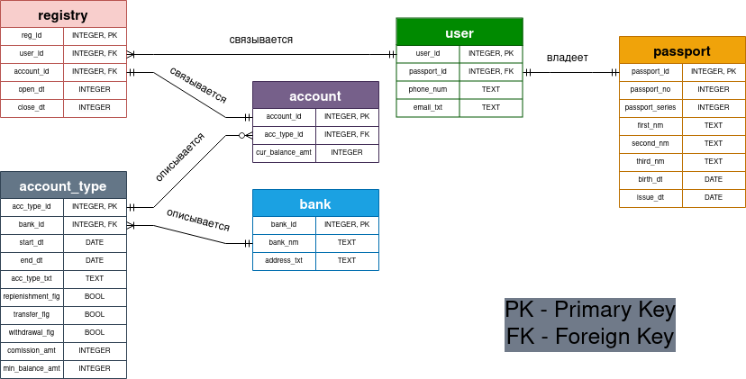

# Проект "Единый Банковский Реестр"

Чтобы скомпилировать `README.md` запусти:

```markdown-pp index.mdpp -o README.md```

### 1. Выбор темы проекта
Предметная область - контроль банковской системы.
Сущности: банк, пользователь, пасспорт, счет, тип счета.

### 2. Проектирование базы данных
**[Концептуальная модель](docs/conceptual-model.png)**


**[Логическая модель](docs/logical-model.png)**



<details open>
    <summary>Физическая модель</summary>

---

Таблица `registry`:

| Название        | Описание               | Тип данных     | Ограничение   |
|-----------------|------------------------|----------------|---------------|
| `reg_id`        | Идентификатор записи(последовательный)   | `BIGINT`       | `PRIMARY KEY` |
| `user_id`       | Идентификатор клиента  | `BIGINT`       | `FOREIGN KEY` |
| `account_id`    | Идентификатор счета    | `BIGINT`       | `FOREIGN KEY` |
| `open_dt`       | Дата открытия счета    | `DATE`         | `NOT NULL`    |
| `close_dt`      | Дата закрытия счета    | `DATE`         |               |

Таблица `user`:

| Название             | Описание                    | Тип данных     | Ограничение   |
|----------------------|-----------------------------|----------------|---------------|
| `user_id`            | Идентификатор клиента(сгенерированный)       | `BIGINT`       | `PRIMARY KEY` |
| `passport_id`        | Идентификатор паспорта      | `BIGINT`       | `FOREIGN KEY` |
| `age_num`            | Возраст клиента             | `VARCHAR(30)`  | `NOT NULL`    |
| `phone_num`          | Номер телефона клиента      | `VARCHAR(30)`  | `NOT NULL`    |
| `email_txt`          | Электронная почта клиента   | `VARCHAR(300)` | `NOT NULL`    |

Таблица `passport`:

| Название             | Описание                        | Тип данных     | Ограничение   |
|----------------------|---------------------------------|----------------|---------------|
| `passport_id`        | Идентификатор паспорта(сгенерированный)            | `BIGINT`       | `PRIMARY KEY` |
| `passport_no`        | Номер паспорта                  | `VARCHAR(30)`  | `NOT NULL`    |
| `passport_series`    | Серия паспорта                  | `VARCHAR(30)`  | `NOT NULL`    |
| `first_nm`           | Имя клиента                     | `VARCHAR(300)` | `NOT NULL`    |
| `second_nm`          | Фамилия клиента                 | `VARCHAR(300)` | `NOT NULL`    |
| `third_nm`           | Отчество клиента                | `VARCHAR(300)` | `NOT NULL`    |
| `birth_dt`           | Дата рождения клиента           | `DATE`         | `NOT NULL`    |
| `issue_dt`           | Дата выдачи паспорта            | `DATE`         | `NOT NULL`    |

Таблица `account`:

| Название            | Описание                        | Тип данных  | Ограничение   |
|---------------------|---------------------------------|-------------|---------------|
| `account_id`        | Идентификатор счета(сгенерированный)               | `BIGINT`    | `PRIMARY KEY` |
| `acc_type_id`       | Идентификатор типа счета        | `BIGINT`    | `FOREIGN KEY` |
| `cur_balance_amt`   | Текущий баланс                  | `MONEY`     | `NOT NULL`    |

Таблица `account_type`:

| Название               | Описание                        | Тип данных      | Ограничение   |
|------------------------|---------------------------------|-----------------|---------------|
| `acc_type_id`          | Идентификатор типа счета(сгенерированный)          | `BIGINT`        | `PRIMARY KEY` |
| `bank_id`              | Идентификатор банка             | `BIGINT`        | `FOREIGN KEY` |
| `start_dt`             | Дата старта условий             | `DATE`          | `NOT NULL`    |
| `end_dt`               | Дата закрытия условий           | `DATE`          |               | 
| `acc_type_txt`         | Тип счета                       | `VARCHAR(300)`  | `NOT NULL`    |
| `replenishment_flg`    | Пополнение разрешено?(Да/Нет)   | `BOOLEAN`       | `NOT NULL`    |
| `transfer_flg`         | Переводы разрешены?(Да/Нет)     | `BOOLEAN`       | `NOT NULL`    |
| `withdrawal_flg`       | Снятие денег разрешено?(Да/Нет) | `BOOLEAN`       | `NOT NULL`    |
| `comission_amt`        | Комиссия банка                  | `MONEY`         | `NOT NULL`    |
| `min_balance_amt`      | Минимальный балас счета         | `MONEY`         | `NOT NULL`    |

Таблица `bank`:

| Название             | Описание                    | Тип данных     | Ограничение   |
|----------------------|-----------------------------|----------------|---------------|
| `bank_id`            | Идентификатор банка(сгенерированный)           | `BIGINT`       | `PRIMARY KEY` |
| `bank_nm`            | Название банка              | `VARCHAR(100)` | `NOT NULL`    |
| `address_txt`        | Адрес банка                 | `VARCHAR(300)` | `NOT NULL`    |

</details>

### 3. DDL скрипты

<details open>
    <summary>3. DDL скрипты</summary>

Создание таблиц:
```postgresql
CREATE SCHEMA cbr;
```

Таблица `bank`:
```postgresql
CREATE TABLE cbr.bank(
   bank_id        BIGINT         NOT NULL,
   bank_nm        VARCHAR(300)   NOT NULL,
   address_txt    VARCHAR(300)   NOT NULL,

   CONSTRAINT PK_bank_id PRIMARY KEY (bank_id)
);
```

Таблица `account_type`:
```postgresql
CREATE TABLE cbr.account_type(
   acc_type_id       BIGINT         NOT NULL,
   bank_id           BIGINT         NOT NULL,
   start_dt          DATE           NOT NULL,
   end_dt            DATE,
   acc_type_txt      VARCHAR(300)   NOT NULL,
   replenishment_flg BOOLEAN        NOT NULL,
   transfer_flg      BOOLEAN        NOT NULL,
   withdrawal_flg    BOOLEAN        NOT NULL,
   comission_amt     MONEY          NOT NULL,
   min_balance_amt   MONEY          NOT NULL,

   CONSTRAINT PK_acc_type_id PRIMARY KEY (acc_type_id),

   CONSTRAINT FK_bank_id FOREIGN KEY (bank_id) REFERENCES cbr.bank(bank_id) 
);
```

Таблица `account`:
```postgresql
CREATE TABLE cbr.account(
   account_id        BIGINT   NOT NULL,
   acc_type_id       BIGINT   NOT NULL,
   cur_balance_amt   MONEY    NOT NULL,

   CONSTRAINT PK_account_id PRIMARY KEY (account_id),

   CONSTRAINT FK_acc_type_id FOREIGN KEY (acc_type_id) REFERENCES cbr.account_type(acc_type_id) 
);
```

Таблица `passport`:
```postgresql
CREATE TABLE cbr.passport(
   passport_id       BIGINT         NOT NULL, 
   passport_no       VARCHAR(30)    NOT NULL, 
   passport_series   VARCHAR(30)    NOT NULL, 
   first_nm          VARCHAR(300)   NOT NULL, 
   second_nm         VARCHAR(300)   NOT NULL, 
   third_nm          VARCHAR(300)   NOT NULL, 
   birth_dt          DATE           NOT NULL, 
   issue_dt          DATE           NOT NULL,
   
   CONSTRAINT PK_passport_id PRIMARY KEY (passport_id)
);
```

Таблица `user`:
```postgresql
CREATE TABLE cbr.user(
   user_id        BIGINT         NOT NULL, 
   passport_id    BIGINT         NOT NULL, 
   age_num        VARCHAR(30)    NOT NULL, 
   phone_num      VARCHAR(30)    NOT NULL,
   email_txt      VARCHAR(300)   NOT NULL,
   
   CONSTRAINT PK_user_id PRIMARY KEY (user_id),
   
   CONSTRAINT FK_passport_id FOREIGN KEY (passport_id) REFERENCES cbr.passport(passport_id)
);
```

Таблица `registry`:
```postgresql
CREATE TABLE cbr.registry(
   reg_id      BIGINT   NOT NULL,
   user_id     BIGINT   NOT NULL,
   account_id  BIGINT   NOT NULL,
   open_dt     DATE     NOT NULL,
   close_dt    DATE,

   CONSTRAINT PK_registry PRIMARY KEY (reg_id),

   CONSTRAINT FK_user_id FOREIGN KEY (user_id) REFERENCES cbr.user(user_id) 
);
```

</details>

